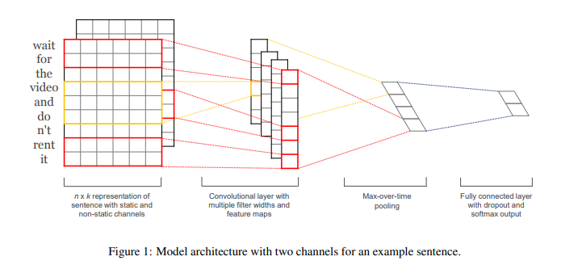

# 本项目为哈尔滨工业大学情感分析与计算实验
本系统主要采用了文本分类的方法，项目由传统神经网络如CNN、RNN等和基于Bert预训练模型的方法构成。  

# 数据集
采用学校老师发放的微博数据集，为json格式，训练集的大小为8000，验证集的大小为2000，测试集大小为3000，格式如下:  
```json
[
  {
    "id": 1,
    "content": "天使",
    "label": "positive"
  },
  {
    "id": 2,
    "content": "致敬[心][心]小凡也要做好防护措施哦//@Mr_凡先生:致敬[心]大家出门记得戴口罩",
    "label": "positive"
  },
  {
    "id": 3,
    "content": "[中国赞][中国赞][中国赞]",
    "label": "positive"
  }
]
```
需要数据集请私信xiong257246@outlook.com。  

# 数据预处理
使用基于


# 实验结果 
TODO

|模型|Accuracy|
|:---:|:---:|
|CNN|%|
|Bert|%|


# 实验
## CNN文本分类
### CNN文本分类内容
CNN文本分类的实验部分主要参考Kim在2014年的Convolutional Neural Networks for Sentence Classification 论文，
模型结构如Figure 1所示。  

CNN的模型主要由四层组成：  
<ol>
<li>第一层：Embedding层，将每个字或词映射为一个词向量。</li>
<li>第二层：卷积层，使用256个卷积核，识别不同的模式。</li>
<li>第三层：池化层。</li>
<li>第四层：全连接层，将结果映射到分类。</li>
</ol>

### CNN文本分类实验结果
本部分基于词的粒度、字的粒度进行词嵌入。如下表所示，使用基于字的粒度时，CNN的精度为70%左右，
而再使用基于SGNS预训练的embedding模型时，以词为粒度，此时精度大约为75.25%，相较于字粒度随机化embedding的方式，
提升了大约5%左右的精度。  
|模型|Accuracy|
|:---:|:---:|
|CNN|71.45%|
|SGNS+CNN|75.25%|


## RNN文本分类


## 基于Bert预训练模型


# 致谢
部分内容参考  
[Chinese-Text-Classification-Pytorch](https://github.com/649453932/Chinese-Text-Classification-Pytorch)  
[Bert-Chinese-Text-Classification-Pytorch](https://github.com/649453932/Bert-Chinese-Text-Classification-Pytorch)  
[Chinese-Word-Vectors](https://github.com/Embedding/Chinese-Word-Vectors)
# 参考文献
[1] Convolutional Neural Networks for Sentence Classification  
[2] BERT: Pre-training of Deep Bidirectional Transformers for Language Understanding  


